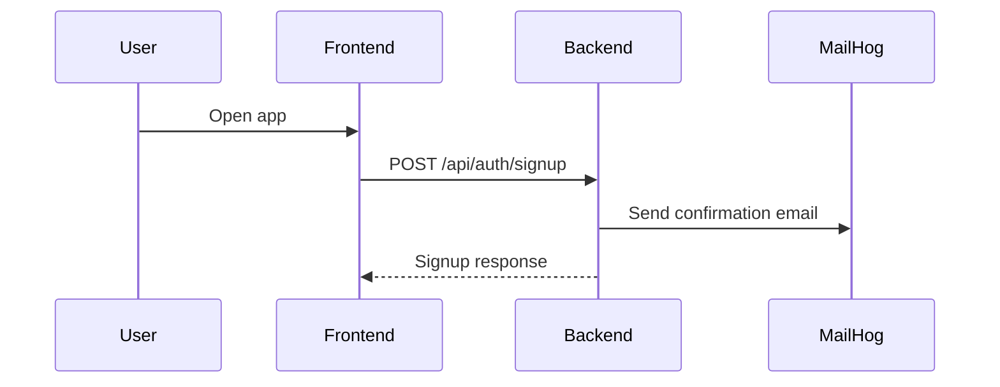
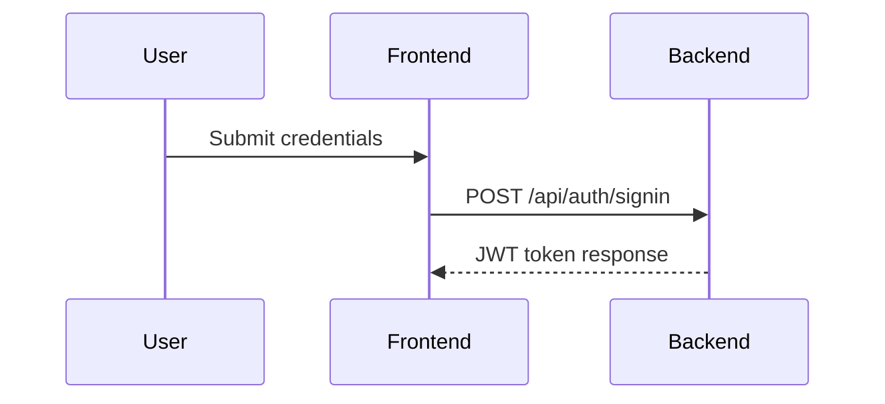
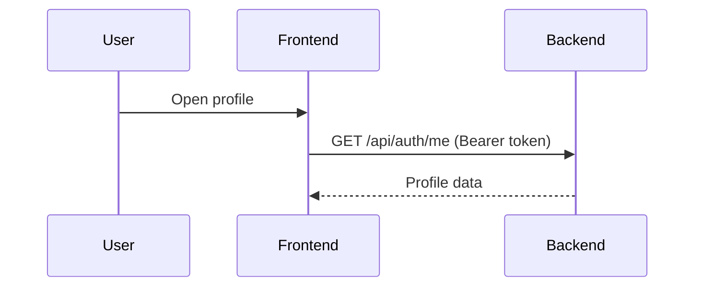
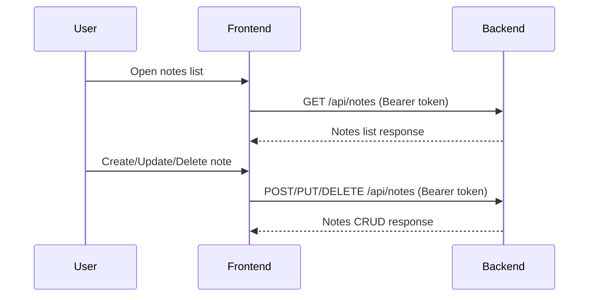

# Service Sequence Diagram

## Sign Up

```mermaid
sequenceDiagram
    participant User
    participant Frontend
    participant Backend
    participant MailHog

    User->>Frontend: Open app
    Frontend->>Backend: POST /api/auth/signup
    Backend->>MailHog: Send confirmation email
    Backend-->>Frontend: Signup response
```

## Sign In

```mermaid
sequenceDiagram
    participant User
    participant Frontend
    participant Backend

    User->>Frontend: Submit credentials
    Frontend->>Backend: POST /api/auth/signin
    Backend-->>Frontend: JWT token response
```

## Profile

```mermaid
sequenceDiagram
    participant User
    participant Frontend
    participant Backend

    User->>Frontend: Open profile
    Frontend->>Backend: GET /api/auth/me (Bearer token)
    Backend-->>Frontend: Profile data
```

## Notes

```mermaid
sequenceDiagram
    participant User
    participant Frontend
    participant Backend

    User->>Frontend: Open notes list
    Frontend->>Backend: GET /api/notes (Bearer token)
    Backend-->>Frontend: Notes list response

    User->>Frontend: Create/Update/Delete note
    Frontend->>Backend: POST/PUT/DELETE /api/notes (Bearer token)
    Backend-->>Frontend: Notes CRUD response
```
